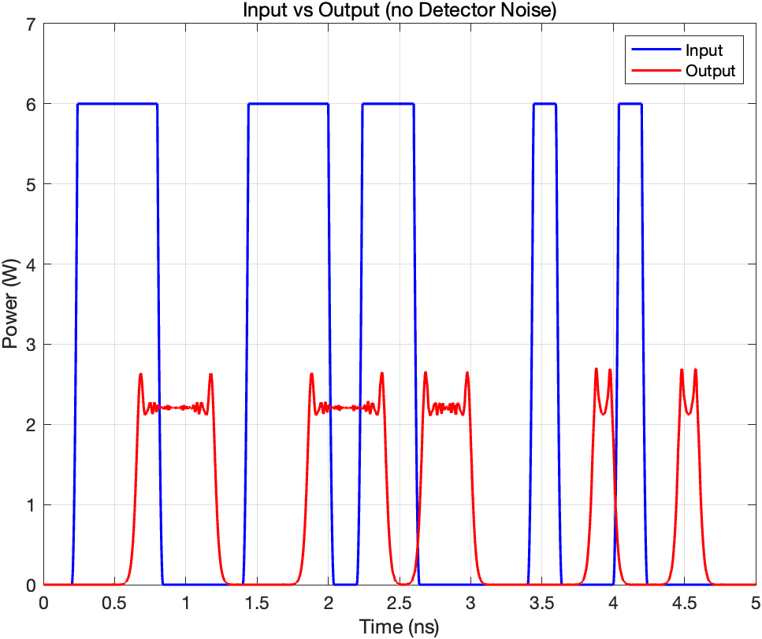
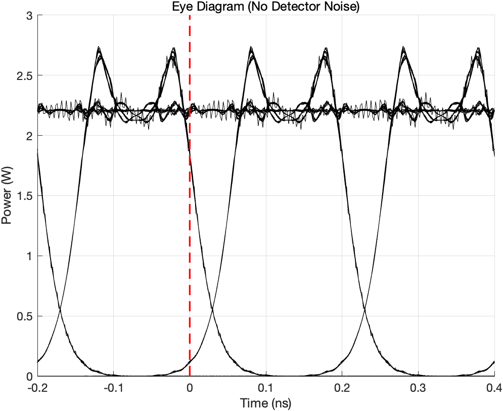
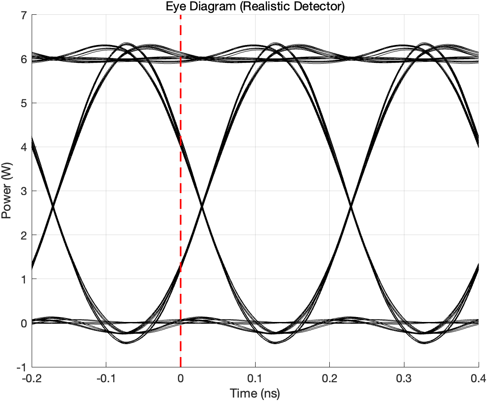
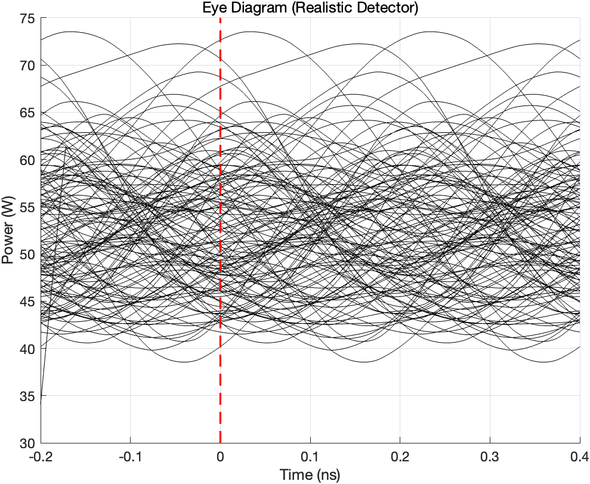
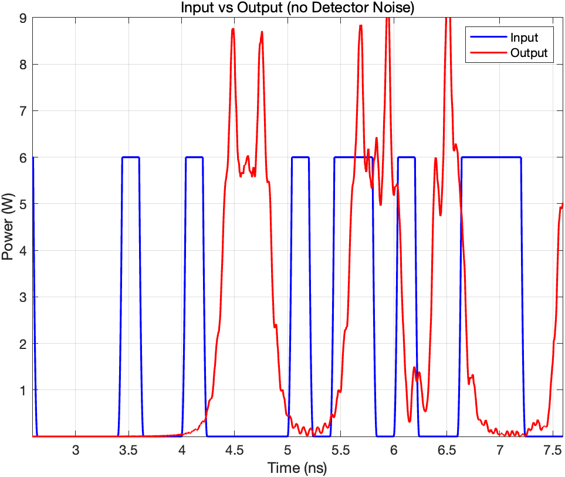
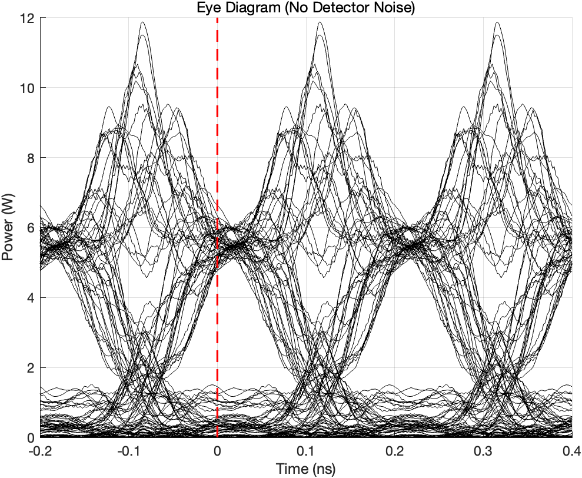

## 第一组情况：

根据我们的讨论，在三种不同的发射方式下，三者的频谱实际上是相同的，都是中心频率在193.102～193.103THz范围之间的单个频谱峰。因此我们认为输出表现上的不同大概是出自对激光光源的不同设置。

这一点推论来自我们对时域图的观察，从最第一行中的时域图能看到，当前的单个bit占据了大约20ns的时间，此时我们认为激光器可以满足当前的响应速度，从而不论是在当前情况的时域图还是眼图中，我们都能看到相对平滑的上下沿（但是存在一定的涨落时间）。

我们认为是出自电驱动的激光器的电噪声越过了触发激光的最低容限，从而为系统带来类似锯齿样震荡。

在第二行的图中，我们认为是电路系统尝试在更快的响应下驱动激光器，导致激光光腔不能及时反馈触发需求，或者说当前的响应速度需求略微超过了激光器的承载能力，从而出现弛豫震荡。

在最后一组情况中，由于当前的触发要求更高，留存给光腔的弛豫时间更短，光完全无法被泵浦源泵浦到的稳定状态，因此充满了激发峰而不是稳定的方波输出。其中的变换快，能量大，导致出现了更高的激发峰。

眼图中，纵轴振幅噪声代表了系统的过冲-由于过快的驱动速度导致的。

为什么太快的驱动速度导致过冲（待整理）

在第三个情况下，根本没有稳定的方波波形输出，时序完全不匹配，表现为多个无稳定相位差的脉冲波形的叠加。

边缘的“毛边”为探测器的热噪声，为高斯白噪声形式思考。（？）

## 第二组情况：

采用不同的调制方式导致有不同的（？）

在这部分，我们首先对后两列的图像的不同点达成了共识：为什么“不理想”的探测器得到了更加平滑的曲线和更加大的上下沿延迟？我们认为这是采用了AD信号转换的“真实的”探测器存在设置偏置或者设置分辩率的问题，导致原本不同的光信号强度被采样-取值-编码后成为了相同的光信号强度由图像绘制，所以才展示出了更加平滑的、没有那么多锯齿的眼图。至于上下沿延迟，我们相信是探测器具有响应时间，因此才带来的更加“平缓”的上下沿（在算法上或许可采用巴特沃斯滤波器等算法进行仿真？）。

我们同时也关注到，即使是在“理想”探测器上，在眼图的最上层和时域图的方波上层都出现了锯齿样的类似“噪声”的存在，我们一是考虑到在探测器的有效尺寸上无法避免环境光的影响，二来也是考虑到在系统中可能存在的色散带来的方波因为不同频率间的相位发生改变，从而“分裂”成为了类似锯齿的单个小峰，这一点我们采用了理想的系统（无噪声，无非线性效应等，仅考虑色散和衰减）在Matlab中进行了仿真，如图所示的，即使是不考虑噪声，仅因为色散的存在我们就能观测到一系列的“锯齿”或者说方波脉冲的分裂趋势。

 

现在考虑“真实”探测器的效果，我在我原有的基础模型（光纤传输、色散、衰减部分为我之前实习期间撰写的模型）上让AI（很遗憾我依旧寻求了ai的帮助）帮我加入了一个巴特沃斯滤波器并进行了AD转换的模拟算法，得到所谓“真实”探测器的高信噪比图像如图所示，可见我们的猜测在ai辅助撰写的完整代码下或许能得到验证。

现在在接收端加入噪声——当然，噪声并不可能来自于传输过程中的光纤，但是考虑到“真实”光电探测器，其中必然存在如散粒噪声等由于光电转换引起的噪声，因此我们选择直接加入一个具有较大绝对数值的噪声，并让输出信号的强度足够小（即采用和前文不同的一个很小的信噪比）来观察在“非理想”探测器上得到的眼图如图，可以发现其“混乱”程度和本组中右下角的情况非常吻合。

因此对于本部分的演化，我们得到结论，虽然在传输过程中存在一定的色散效应导致“理想”探测器得到了一些带有震荡分裂的眼图，但是当前系统中最严重的问题却是衰减过于严重（这一点其实可以通过查看时域脉冲纵轴得到结论）导致的信噪比逐渐降低，从而在“非理想”探测器的光电噪声中丢失了信号检测，从而变成了一团没有规律的乱线。

当高于阈值的时候会出现噪声（？）

SNR因为传输距离的原因，功率大幅度下降（可以在时域看到）

考虑绘制SNR对比

## 第三组情况：

根据老师的指导，我们得知当前的频谱在不同距离的传输后仅有幅度变化，因此我们认为系统中不存在任何可以改变频率成分的现象——即不考虑非线性效应，而根据时域中的不同脉冲随着距离的变换逐渐分裂，我们认为在这次的系统中虽然同时存在色散和衰减，但是导致眼图和方波变得几乎不可辨认的是色散效应。

采用一些比较极端的仿真方式来验证这一点：采用完美探测器，删除掉所有的噪声，并将模型的衰减取0（并非完全符合题目中的情况，但是可以更好的看到色散的效果，题目中依旧存在衰减），得到方波传输前后的对比如图所示，可以看到因为色散效应，原本的方波波形被完全摧毁，转为一些彻底分裂的峰或双边存在冲击的低平坦脉冲，再绘制此时的输出眼图如图，能发现眼图的“眼”已经完全变了样子，而是变成了近似题目中本组右下角图的形态，因此在当前的仿真中，我们所假设的强色散效应可以解释当前的情况，满足题目需求。

